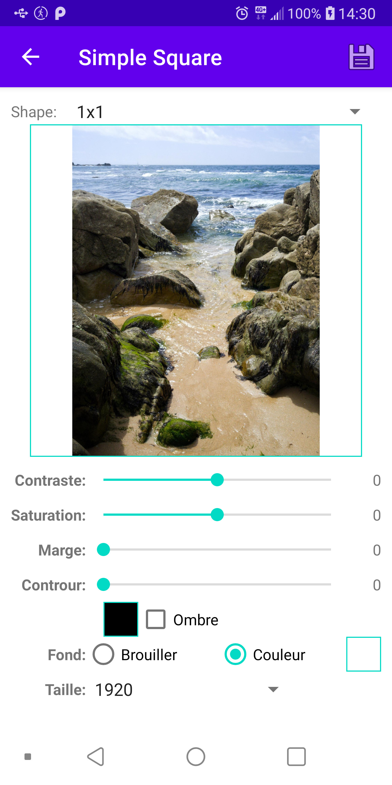
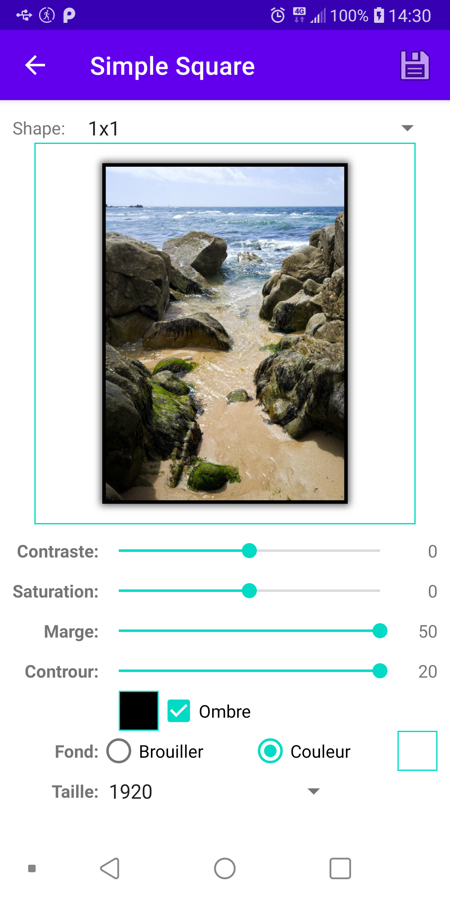
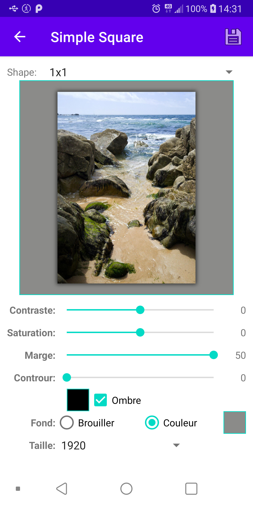
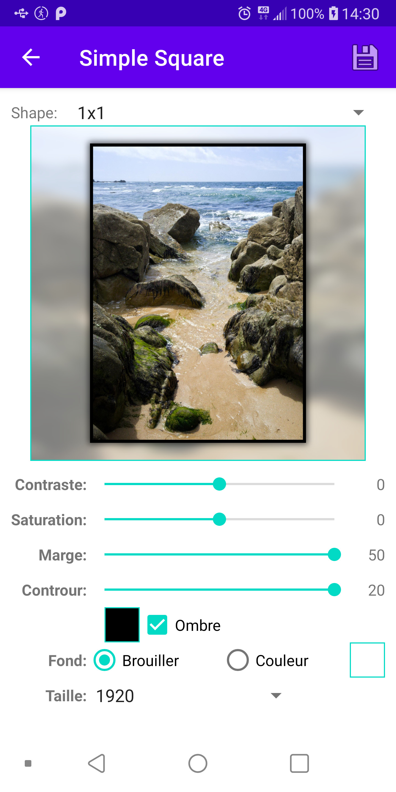
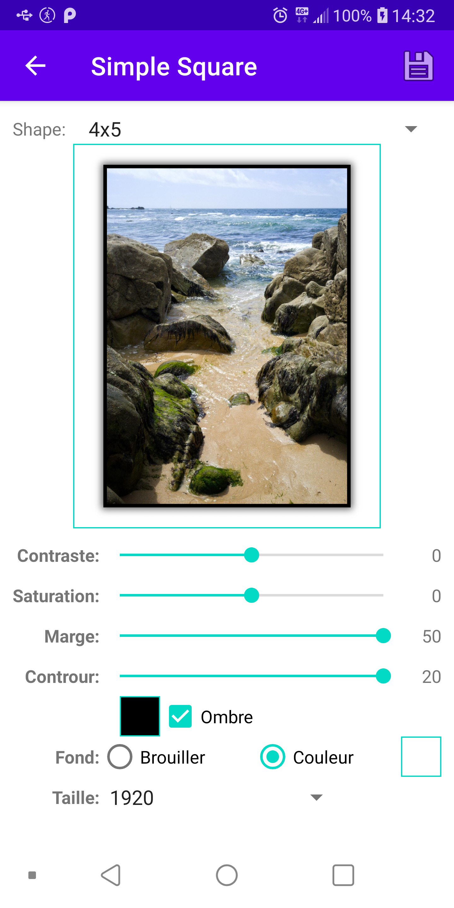
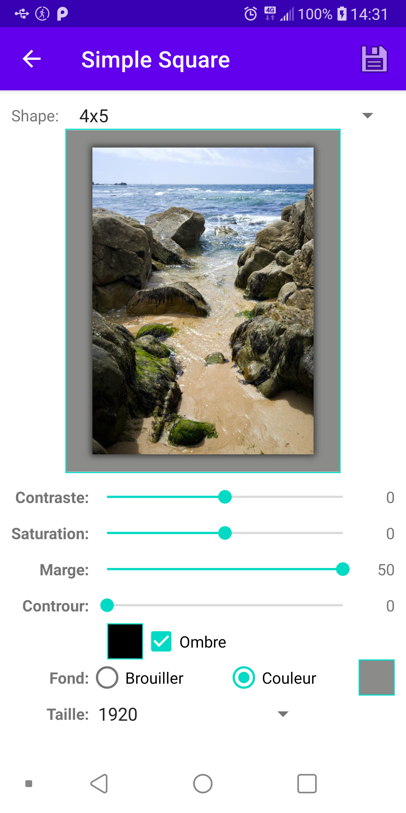
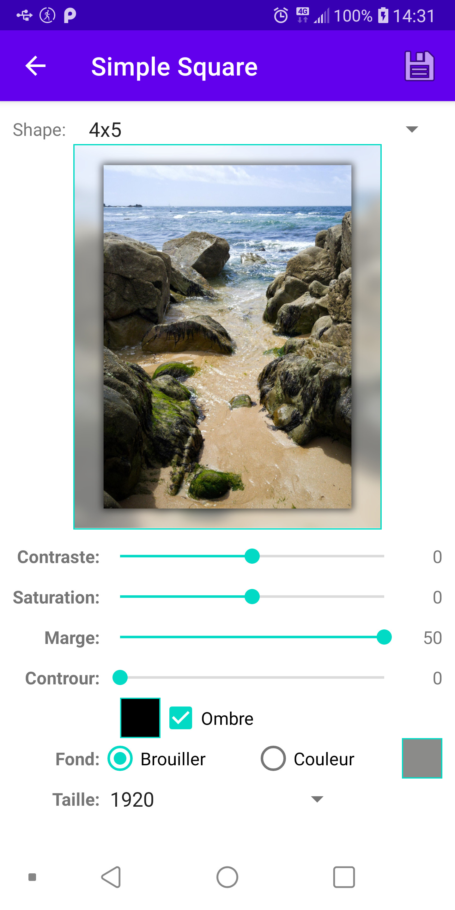

# SimpleSquare

The initial idea was to fix a photo in a 4x5 image (suitable for Instagram).
Now it support 4x5 ratio too, so the name is not perfect.

You can change:
* Margin: size & color
* Border: size & color
* Background: color or a blurry version of the photo
* Shadow
* You can also tune: contarst and saturation
* You can export the image at height of: original height, 1920, 1080 

## Examples 1x1 ##

 |  |  |  | 
--- | --- | --- | --- | ---

## Examples 4x5 ##

 |  |  |  | 
--- | --- | --- | --- | ---
